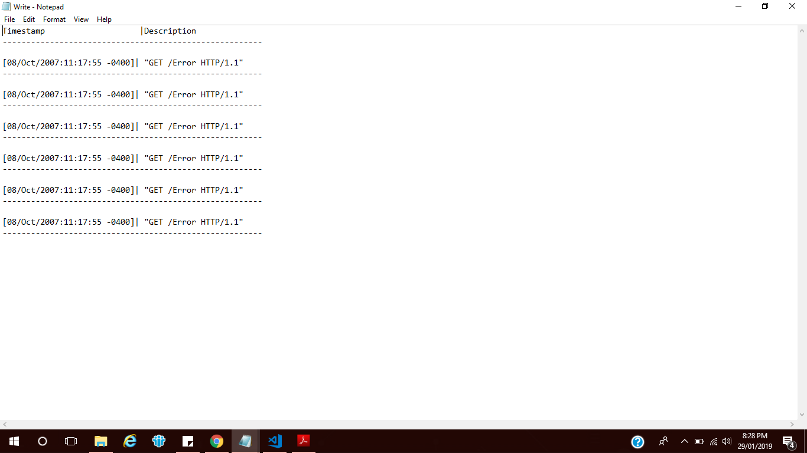

# ScalaSampleCode
Code to display error logs from log file (Sample Code)

# Creating scala project on eclipse

1. Download Eclipse's Scala IDE from http://scala-ide.org/ and extract it on your local system
2. Open Eclipse Click on File > New > Scala Project > Project Name, Select correct JRE version and Click finish
3. Right click on project > New > Scala class , Name it as ScalaErrorLog and Finish.
4. Copy the code and paste it.
5. Click on the green play button arrow and run it as a Scala application.
6. Check the console for the output.

# Code logic

1. Data Input file - Log File
2. Use printWriter to print the output to a text file
3. Read through each lines of the log file
4. Filter the lines which contains Error keyword
5. Print the date and error description using substring
6. Close the output file

# Input

Log file

# Output

      

# Thank you
